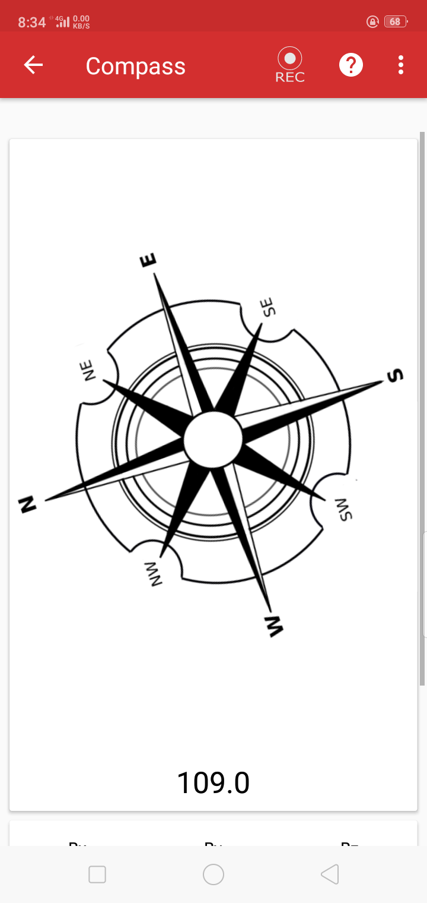
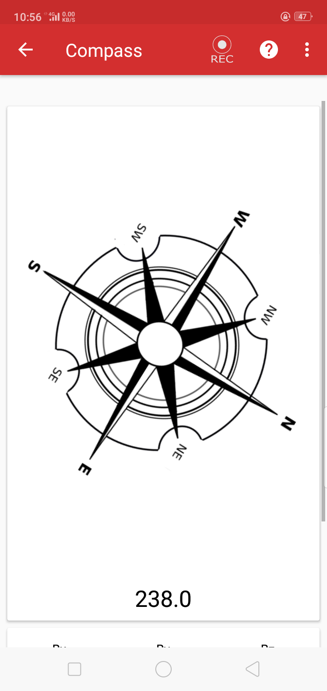
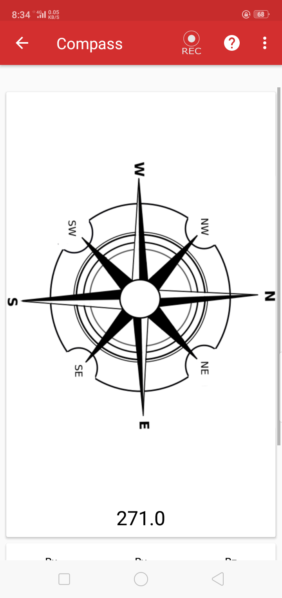

# pslab-Compass
PSLab Documentation and Experiments https://docs.pslab.io

  Introduction: I propose an experiment on psLab using current .

  Requirements: PsLab installed with a compass sensor.
  
  Observations : 
     1. When I Pass a wire through compass then I found no deflection in the compass.
     2. When I pass current through the wire then I notice a deflection in the compass.
   
  Results : PsLab compass shows deflection when I pass current through wire. 

 Screenshots:

1)Without Current:

2)With Current:

