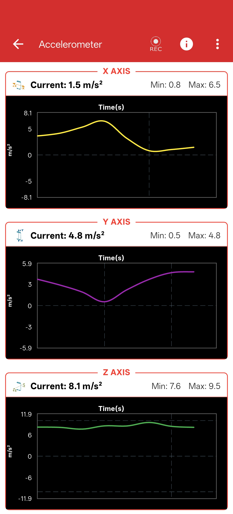

# Accelerometer

## What is an Accelerometer?

An accelerometer is a scientific instrument used to measure the proper acceleration of a body along the X, Y, and Z axes. 

---

## Experiment: Measuring Acceleration

{ align="right" width="200" }

### Learning Objectives
To find the acceleration of a body along different axes in real-time.

### Materials Required
- Your Phone or Computer
- The **PSLab App** installed

### Procedure

1. Open the **PSLab app**.
2. Navigate to the **Instruments** section and select the **Accelerometer**.
3. You will see three real-time graphs representing acceleration along the X-axis, Y-axis, and Z-axis.

4. You can configure the Accelerometer (update period, sensor gain, etc.) using the settings menu in the top right corner.
5. Move your device in various directions (up/down, left/right, forward/backward) to observe the changes along each respective axis.

### Observations

- As you move the device along different axes, you will immediately see a corresponding change in the acceleration data on the respective tabs.
- The acceleration is represented cleanly in both numerical form and as a continuous scrolling graph for easy analysis.

