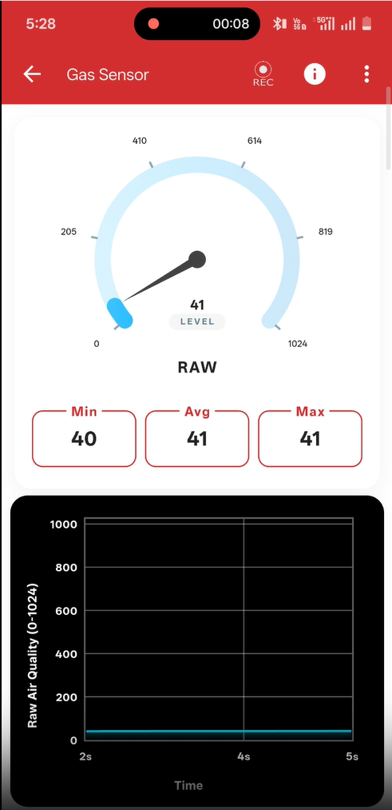

# Gas Sensor

## Introduction

To use this instrument, you need an **MQ-135 semiconductor gas sensor**.

The MQ-135 is a broad-spectrum semiconductor gas sensor. It utilizes a Tin Dioxide (SnO2) sensitive layer whose electrical conductivity changes when exposed to clean air versus air polluted with target gases. It is primarily intended for detecting flammable gases and broad air quality, but its readings can be mathematically translated to estimate CO2 Concentration (PPM), eCO2, TVOC (ppb), and overall Air Quality.

---

## How to Connect

{ width="400" }

1. Connect the PSLab **+5V** pin to the sensor's **VCC** pin.
2. Connect the PSLab **GND** pin to the sensor's **GND** pin.
3. Connect the PSLab **CH1** pin to the sensor's **Analog Out (A0)** pin.

---

## The Mathematical Formula

The sensor does not read gases individually. Instead, any detectable gas causes the sensor's internal resistance (Rs) to drop relative to its baseline resistance in fresh air (R0).

**ppm = a * (Rs / R0)^b**

Where **a** represents the scaling multiplier and **b** represents the curve slope. By altering these coefficients based on the manufacturer's datasheet curves, the PSLab app can calculate estimations for different gases:

- **Carbon Dioxide (CO2):** a ≈ 110.5, b ≈ -2.86
- **Ammonia (NH3):** a ≈ 102.2, b ≈ -2.47
- **Alcohol / Ethanol:** a ≈ 75.4, b ≈ -3.12

!!! warning "Important Scientific Limitation"
    Because the sensor reacts to all of these gases simultaneously on the same electrical line, it cannot differentiate between them. For example, if you configure the configuration menu to display Ammonia (NH3), but alcohol fumes enter the room, the sensor will misinterpret the resistance drop and show a massive, false spike in Ammonia.
    
    Therefore, all target-specific outputs are mathematical approximations assuming a strictly controlled background environment.

!!! info "Calibration Note"
    Readings are estimated based on default load and baseline resistances and strictly assume a fresh air environment during calibration. If the sensor is unreadable, the app will prompt: *Gas Sensor Unavailable. Please connect Gas Sensor*.
