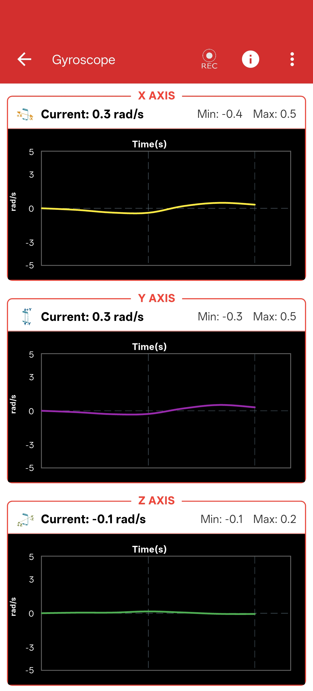

# Gyroscope 

## Introduction

The PSLab includes a Gyroscope instrument which provides an easy way to measure rotational motion at a scientific level, right in your pocket. The accompanying PSLab app gives the user real-time angular velocity data from the gyroscope on the device.

---

## Layout

The layout consists of three different dynamic graph plots for rotational motion along the X, Y, and Z axes. 

There is also an option to deeply configure the Gyroscope using the settings menu in the top right corner.

{ width="400" }

---

## Configuration

You can change the update period, high limit, sensor gain, and can optionally include location data for your experiments.

- **Update Period:** How fast the gyroscope updates motion (in milliseconds).
- **High Limit:** How high of a rotational angle the motion can reach, recorded in radians.
- **Sensor Gain:** The gain applied to the sensor during the rotational motion.
- **Include Location Data:** Whether you want to include your GPS location coordinates alongside the logged gyroscope data.

---

## How to Use it

The Gyroscope continuously records rotational motion data from your device. You can rotate and turn it in whichever way you would like to observe the angular velocity changes across all three axes. 

!!! tip "Data Logging"
    You can easily choose to record the data session, which will save all the rotational measurements into a CSV file for advanced analysis on your computer later!
