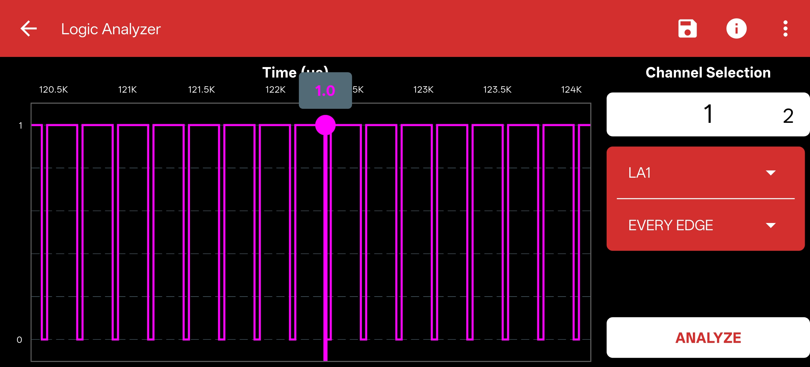

# Logic Analyzer

## Overview
A logic analyzer is an electronic instrument that captures and displays multiple signals from a digital system or digital circuit. While an oscilloscope measures continuous analog voltage, a logic analyzer reads discrete digital logic levels (0s and 1s) over time.

{ width="800" }

---

## Working Principle
It works by sampling the digital inputs at a very high rate relative to the system being measured. It compares the sampled voltages against a user-defined threshold to determine if the signal is logic HIGH or LOW. These digital states are stored in memory and then displayed as a timing diagram.

---

## How to use it in the PSLab App

The Logic Analyzer is built directly into the PSLab hardware and is fully accessible via the PSLab app across all supported platforms.

1. **Connect the Pins:** Connect the digital signals you wish to analyze to the Logic Analyzer pins (`LA1`, `LA2`, `LA3`, `LA4`) on the PSLab board. Ensure you also connect the ground of your circuit to a `GND` pin on the PSLab.
2. **Open the Instrument:** Launch the PSLab app and select the **Logic Analyzer** instrument from the home screen.
3. **Configure Channels:** Select which specific channels you want to actively monitor.
4. **Set Trigger:** Configure a trigger condition (e.g., a rising edge on `LA1`) so the analyzer knows exactly when to start capturing the data stream.
5. **Analyze:** Capture the data and use the intuitive interface to pan and zoom through the timing diagram to verify your digital signals.

!!! tip "Protocol Decoding"
    The Logic Analyzer helps you decode standard serial communication buses (like I2C, SPI, and UART) directly from the captured digital waveforms.

---

## Applications
- Debugging digital circuits and communication protocols.
- Verifying strict timing relationships between multiple digital signals.
- Analyzing state machine transitions in microcontrollers or FPGAs.

## Specifications
- **Channels:** Supports 4 channels for simultaneous, high-speed measurement.
- **Protocol Support:** Built-in tools for analyzing standard serial buses.
- **Input Voltage Range:** Defined by the standard logic levels of the device under test (e.g., 3.3V, 5V).

---

## References
- [PSLab Open Source Hardware](https://pslab.io/)
