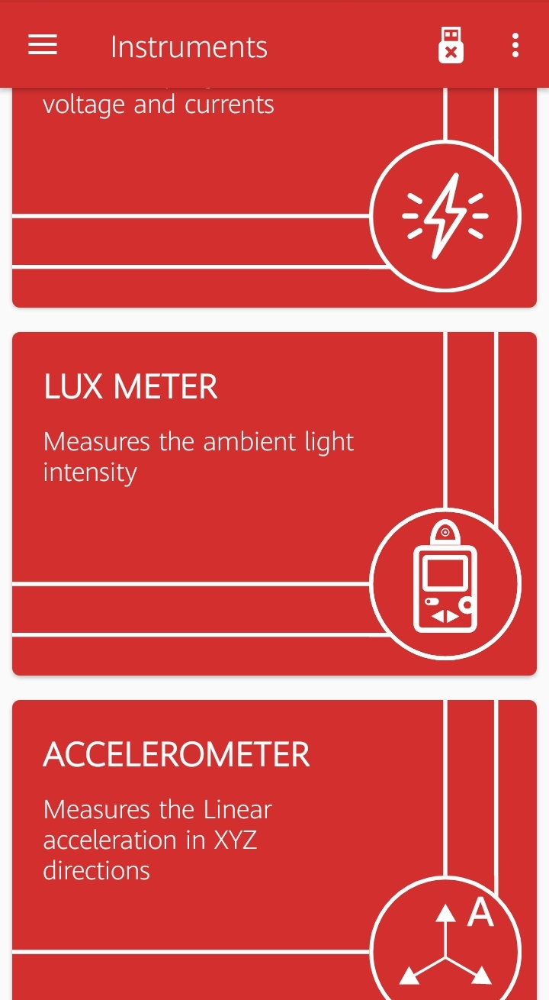
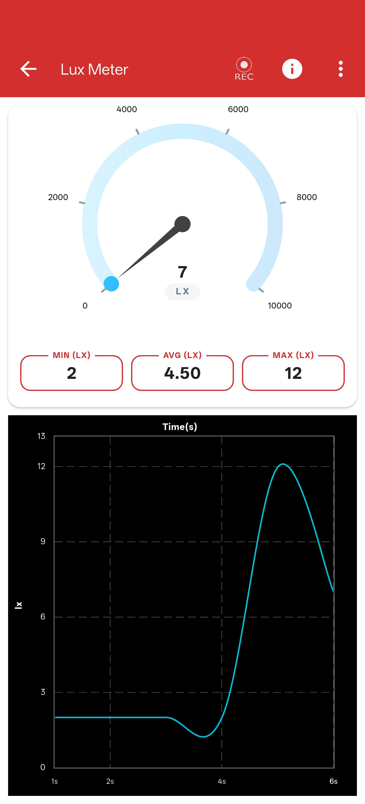

# Lux Meter

## What is a Lux Meter?

A Lux Meter is a scientific instrument used to measure the intensity of light (illuminance) in an environment. The measurement unit used is "lux", which represents one lumen per square meter.

---

## Experiment: Measuring Light Intensity

{ align="right" width="250" }

### Learning Objectives
To measure and compare the intensity of different light sources using your device's built-in light sensor.

### Materials Required
- Your Phone or Computer
- The **PSLab App** installed

### Procedure

1. Open the **PSLab app**.
2. Navigate to the **Instruments** section and select the **Lux Meter**.
3. You will immediately see a graphical representation as well as a numerical readout of the current light intensity (lux).
4. Bring your device near different light sources (e.g., a yellow incandescent bulb, a white LED, natural sunlight, or a monitor screen). 

!!! tip "Locating your Sensor"
    On smartphones, the ambient light sensor is usually located on the front of the device, right next to the front-facing camera or the ear speaker. Make sure not to cover it with your hand!

---

### Observations

{ align="right" width="250" }

- As you move the device closer to a light source, the lux reading will increase sharply.
- Different types of light bulbs (even of the same perceived brightness) may produce distinctly different lux values.
- You can easily observe these dynamic changes in real-time on both the scrolling graph and the analog-style meter.

### Conclusion

The PSLab Lux Meter accurately utilizes your device's light sensor to provide real-time illuminance readings, allowing you to reliably compare the intensity of various light sources.

