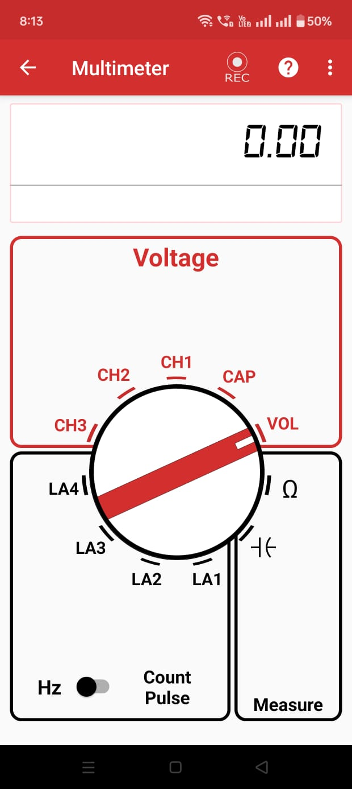
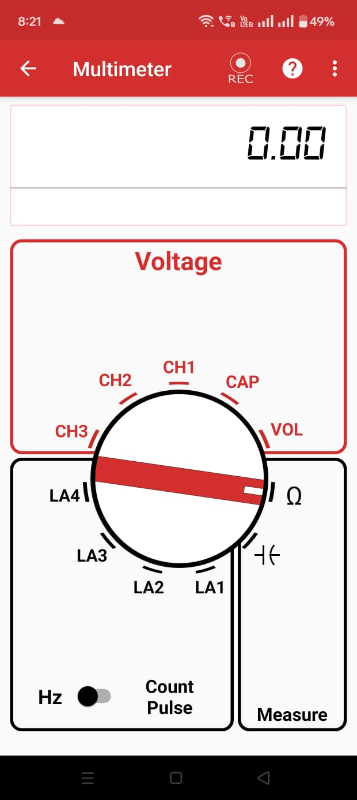
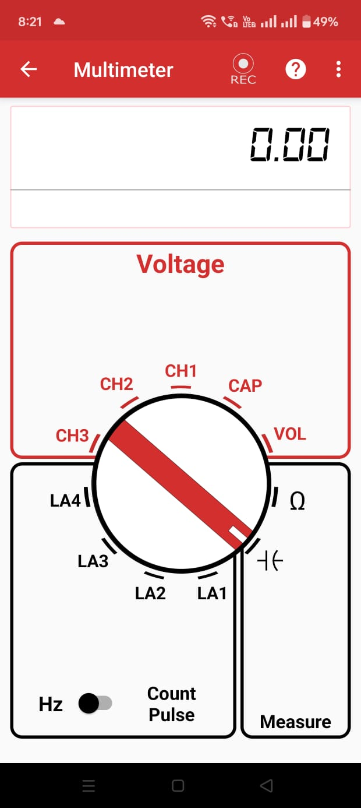
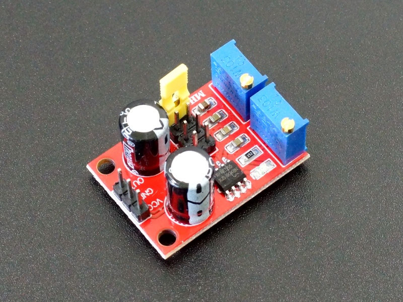
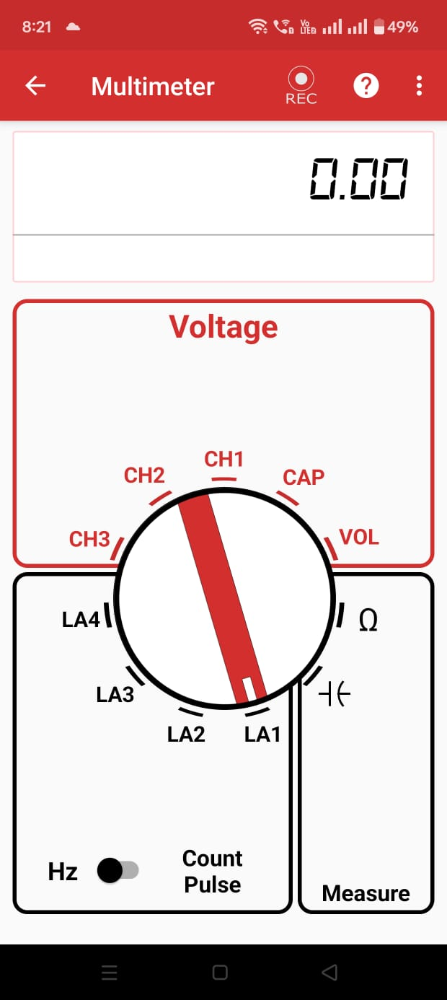

# Multimeter

## What's a Multimeter
A multimeter is an electronic tool used to measure various electrical properties such as voltage, current, resistance, capacitance and frequency. It is used to measure voltage and current values at various points in a circuit that can be used for analysis of the electrical circuits and help in troubleshooting.

---

## How to use it

* Open the **PSLab** app.
* Navigate to the Multimeter option on the home screen.
* Select the type of measurement needed:
    * Voltage
    * Frequency
    * Clock Pulses
    * Resistance
    * Capacitance

{ align="right" width="250" }

* **For measuring voltage, use:**
    * `CH1` (16.5V to -16.5V)
    * `CH2` (16.5V to -16.5V)
    * `CH3` (3.3V to -3.3V)
    * `VOL` (3.3V to -3.3V)
    * `CAP` (Voltage Measurement on CAP)

* **For measuring frequency (Up to 4 MHz) or clock pulses:**
    * Logic Analyzer 1 (`LA1`)
    * Logic Analyzer 2 (`LA2`)
    * Logic Analyzer 3 (`LA3`)
    * Logic Analyzer 4 (`LA4`)

* **For measuring capacitance:**
    * `-| (-` (pF to uF range)

* **For measuring resistance:**
    * `Ω`

### Important Features

* **Multimeter Configuration:**
    * The **update period** can be selected.
    * The **location data** can be included in logged files.

* **Logged data:**
    * It stores the logs of the data collected by the multimeter for later analysis.

---

## Experiment: Measuring Voltage (check your battery)

{ align="right" width="250" }

### Goal
Measure the voltage of a battery using PSLab.

### Materials Required
- Your Phone or Computer
- The **PSLab App** installed
- Battery (1.5V)

### Procedure

{ align="right" width="250" }

1. Open the PSLab app.
2. Select the **Multimeter** option.
3. The app will display various Multimeter options:
   - **Voltage**
   - **Hz**
   - **Count Pulse**
   - **Measure**
4. Choose **VOL** in **Voltage**.
5. Connect the voltage and ground terminals of the battery to the `VOL` and `GND` pins respectively using connecting wires.
6. The voltage is displayed and stored in the logs if the option is selected by the user.

### Observations
- The reading of the Multimeter starts increasing as the battery is connected.
- The PSLab successfully measures the battery voltage.

### Conclusion
The PSLab accurately measures the battery voltage.

---

## Experiment: Measuring Resistance

{ align="right" width="250" }

### Goal
Measure the resistance of a resistor using PSLab.

### Materials Required
- Your Phone or Computer
- The **PSLab App** installed
- Resistor (220 Ω)

### Procedure

{ align="right" width="250" }

1. Open the PSLab app.
2. Select the **Multimeter** option.
3. The app will display various Multimeter options:
   - **Voltage**
   - **Hz**
   - **Count Pulse**
   - **Measure**
4. Choose **Ω** in **Measure**.
5. Connect the end terminals of the resistor to the `RES` and `GND` pins respectively using connecting wires.
6. The Resistance is displayed and stored in the logs if the option is selected by the user.

### Observations
- The value of the resistor is displayed on the multimeter screen.
- The PSLab successfully measures the resistance value.

### Conclusion
The PSLab accurately measures the resistance of the resistor.

---

## Experiment: Measuring Capacitance

{ align="right" width="250" }

### Goal
Measure capacitance using PSLab.

### Materials Required
- Your Phone or Computer
- The **PSLab App** installed
- Capacitor (110 pF)

### Procedure

{ align="right" width="250" }

1. Open the PSLab app.
2. Select the **Multimeter** option.
3. The app will display various Multimeter options:
   - **Voltage**
   - **Hz**
   - **Count Pulse**
   - **Measure**
4. Choose **-| (-** in **Measure**.
5. Connect the terminals of the capacitor to the `CAP` and `GND` pins respectively using connecting wires.
6. The Capacitance is displayed and stored in the logs if the option is selected by the user.

### Observations
- The value of the capacitor is displayed on the multimeter screen.
- The PSLab successfully measures the capacitance.

### Conclusion
The PSLab accurately measures the capacitance of the capacitor.

---

## Experiment: Measuring Frequency

{ align="right" width="250" }

### Goal
Measure the frequency of a 555 timer using PSLab.

### Materials Required
- Your Phone or Computer
- The **PSLab App** installed
- 555 timer board (6.86 kHz)

### Procedure

{ align="right" width="250" }

1. Open the PSLab app.
2. Select the **Multimeter** option.
3. The app will display various Multimeter options:
   - **Voltage**
   - **Hz**
   - **Count Pulse**
   - **Measure**
4. Choose **LA1** in **Hz**.
5. Connect the voltage and ground terminals of the 555 timer board to Logic Analyzer 1 (`LA1`) and `GND` respectively using connecting wires.
6. The Frequency is displayed and stored in the logs if the option is selected by the user.

### Observations
- The frequency value is displayed on the multimeter screen.
- The PSLab successfully measures the frequency.

### Conclusion
The PSLab accurately measures the frequency of the 555 timer board.

