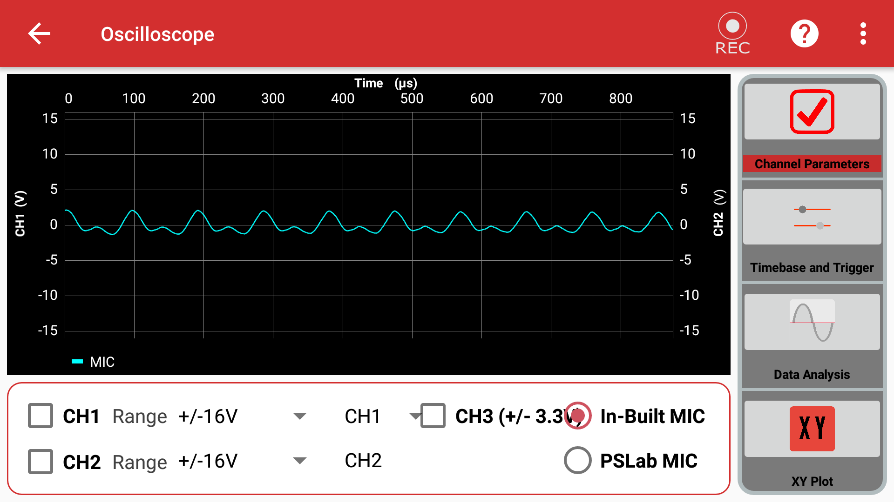
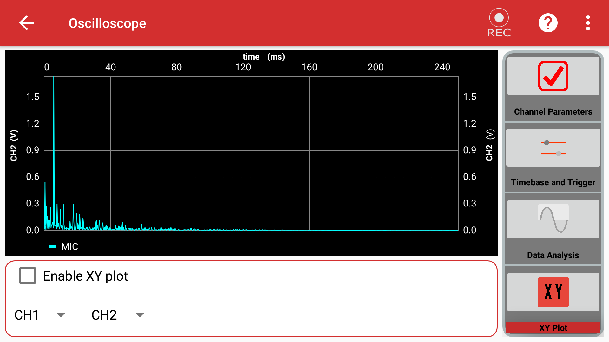
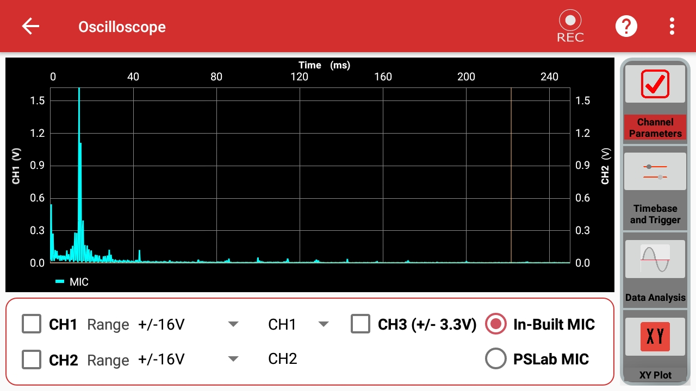

# Oscilloscope

An oscilloscope is an essential scientific instrument used to observe and measure voltage changes over a period of time in real time. It allows you to visualize the exact shape of an electrical wave.

{ width="49%" } { width="49%" }

---

## How To Use It

You can use the oscilloscope to measure both analog and digital signals generated by the PSLab or external circuits.

1. **Connect the Pins:** 
   - *Analog mode:* Connect the `SI1` and `SI2` pins on the PSLab board to the `CH1` and `CH2` pins respectively.
   - *Digital mode:* Connect the `SQ1`, `SQ2`, `SQ3` pins to the `CH1`, `CH2`, `CH3` pins respectively.
2. **Generate a Wave:** Go to the **Wave Generator** instrument in the PSLab app.
3. Select either **Digital** or **Analog** mode.
4. Set your desired frequency, phase, and duty values for Wave1/Wave2 (Analog) or SQ1/SQ2/SQ3 (Digital).
5. Exit the Wave Generator and open the **Oscilloscope** instrument in the PSLab app.
6. Select any combination of the `CH1`, `CH2`, `CH3` checkboxes to see the waves generated at each channel.
7. **Adjust Timebase:** Change the timebase of the waves from the *Trigger and Timebase* section on the control panel.
8. **XY Plot:** Plot waves against each other from the *XY-Plot* section.
9. **Data Analysis:** View the results of a Fourier transform or curve fitting from the *Data Analysis* section.
10. **Microphone Input:** You can use the built-in microphone of your device as an input by selecting the **IN-BUILT MIC** option on the main screen.
11. **Record Data:** Use the record button to capture the currently generated waves, store the data in a CSV file, and play it back at will.

---

## Experiment: Measure Sound Intensity

**Goal of the experiment:** To measure the intensity of sound produced using your device's built-in microphone.

### Materials Required
- Your Phone or Computer
- The **PSLab App** installed

### Procedure

1. Open the PSLab app.

2. Select the **Oscilloscope** instrument.
3. On opening the app, you will see various configuration sections:
     - Channel Parameters
     - Timebase and Trigger
     - Data Analysis
     - XY Plot
4. Open **Channel Parameter** and select the **In-Built MIC** option.

    { width="800" }

5. Next, open the **Data Analysis** menu and select **Fourier Transforms**.
6. Try recording different sounds (whistling, clapping, speaking) using the built-in record option.

### Observations

On observing the recorded sound from the logs, you will notice a large displacement (amplitude) in the graph for loud sounds, and a smaller displacement for faint sounds. The frequency will change based on the pitch.

**High Pitch**

{ width="800" }

**Low Pitch**

{ width="800" }

### Conclusion
From the above experiment, we can conclude that the PSLab app's Oscilloscope can be reliably used to measure both the intensity and frequency characteristics of sound.
