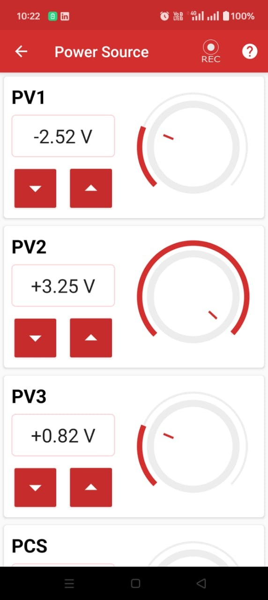
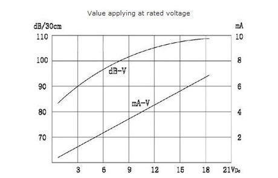
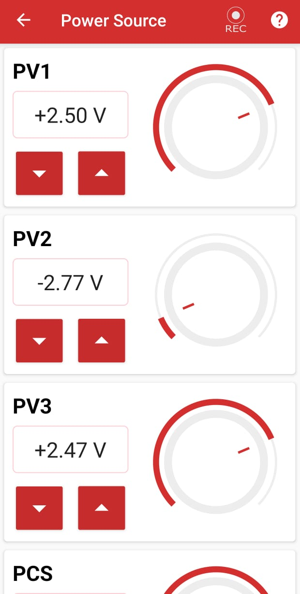

# Power Source

## What is a Power Source?

A power source is an instrument used to supply power to other equipment and sensors, enabling them to operate. The power is provided in the form of voltage or current.

## Current Power Source Ranges

**Voltage Sources:**
- **PV1**: ± 5 V
- **PV2**: ± 3.3 V
- **PV3**: 0-3 V

**Current Sources:**
- **PCS**: 0 - 3.3 mA

---

## How to Use

{ align="right" width="250" }

To use the variable power supply, connect the output terminals from the PSLab board to the circuit nodes according to your specific requirement.

### Procedure for Supplying Power:

1. Select the required power source from **PV1, PV2, PV3,** or **PCS**.
2. Set the desired value for the power source using the app interface.
3. Connect the board pins to your external equipment, such as an LED or sensor.

!!! info "Important Features"
    - **PV1** and **PV3** are proportional to each other.
    - **PV2** and **PCS** are inversely proportional to each other.

---

## Experiment: Powering an LED

### Goal
To power an LED using the PSLab inbuilt power supply.

### Materials Required
- Your Phone or Computer
- The **PSLab App** installed
- White LED with a power rating of approximately 3.2V
- Connecting jumper wires

### Procedure

{ align="right" width="250" }

1. Open the PSLab app.
2. Select the **Power Source** option from the main menu.
3. The app will display various power source options:
   - **PV1**
   - **PV2**
   - **PV3**
   - **PCS**
4. Choose **Voltage Source 2 (PV2)** for this experiment and set its value to the LED voltage (~3.2V).
5. Connect the `GND` pin and the `PV2` terminal to the LED's cathode (short leg) and anode (long leg) respectively using connecting wires.
6. Adjust the power source knob in the app until the required voltage is reached.
7. The LED will start glowing.

### Observations
- The LED illuminates cleanly when the correct voltage is applied.
- The PSLab successfully and safely supplies the required power.

### Conclusion
The PSLab power source can effectively power an external LED.

---

## Experiment: Powering a Buzzer

{ align="right" width="250" }

### Goal
To power a buzzer using the PSLab inbuilt power supply.

### Materials Required
- Your Phone or Computer
- The **PSLab App** installed
- Buzzer with a rating of 3V
- Connecting jumper wires

### Procedure

{ align="right" width="250" }

1. Open the PSLab app.
2. Select the **Power Source** option.
3. The app will display various Power Source options:
   - **PV1**
   - **PV2**
   - **PV3**
   - **PCS**
4. Choose **Voltage Source 1 (PV1)** and set its value to the buzzer's starting voltage (~2.5V).
5. Connect the `GND` pin and the `PV1` terminal to the buzzer terminals using connecting wires.
6. Adjust the power source knob in the app until the required voltage is reached.
7. The buzzer will start producing sound.
8. Gradually increase the voltage in the app to increase the buzzer's sound intensity.
9. Adjust the voltage as needed to achieve the desired sound level.

### Observations
- The buzzer starts producing sound immediately when the correct voltage is applied.
- The sound intensity scales dynamically as the voltage changes.

### Conclusion
The PSLab Power Source can effectively power a buzzer and modulate its intensity.

