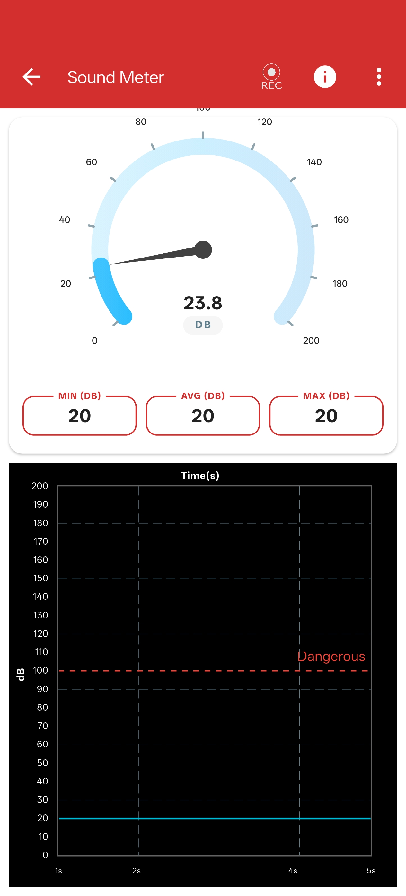

# Sound Meter

## What is a Sound Meter?

A Sound Meter (or decibel meter) is an instrument used to measure environmental noise and audio levels. It quantifies the acoustic pressure of sound waves and represents the intensity in decibels (dB).

---

## Measuring Ambient Noise

{ align="right" width="200" }

### Learning Objectives
To measure and observe changes in environmental sound intensity using your device's built-in microphone.

### Materials Required
- Your Phone or Computer
- The **PSLab App** installed

### Procedure

1. Open the **PSLab app**.
2. Navigate to the **Instruments** section and select the **Sound Meter**.
3. You will see a real-time graphical representation of the ambient sound levels.
4. Try speaking softly, clapping your hands, or moving to a noisy environment to see how the graph reacts to different audio intensities.

!!! tip "Microphone Location"
    Ensure that you do not accidentally cover the primary microphone on your device (usually located at the very bottom edge of your phone) while running this experiment.

