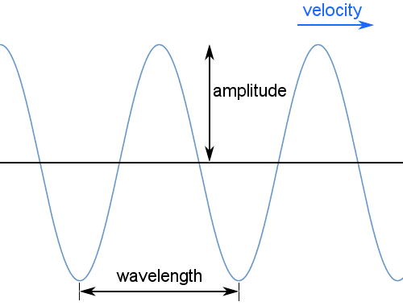
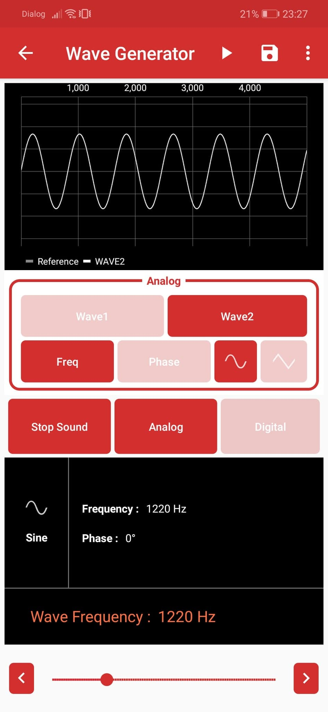
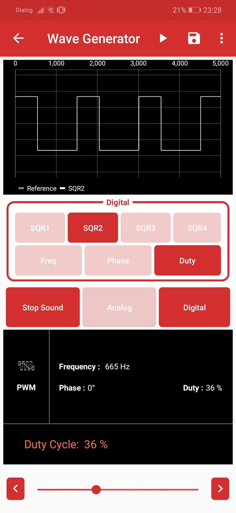

# Wave Generator

## Introduction to Waves

A wave is a physical phenomenon characterized by its frequency, wavelength, and amplitude. In general, waves transfer energy from one location to another, in which case they have a velocity.

{ width="600" }

Standing waves may also occur; these have no net velocity and involve no net transfer of energy. They have frequency, wavelength, and amplitude. 

Mechanical waves require a medium to travel through: for example, sound waves and earthquake waves cannot travel through a vacuum. Electromagnetic waves, such as light, do not require a medium and can travel through a vacuum.

Transverse waves, such as light, oscillate perpendicular to the direction the wave is carrying energy as in the diagram above. Longitudinal waves, such as sound, oscillate parallel to the direction of energy transfer.

---

## How to use the Wave Generator

{ align="right" width="250" }
{ align="right" width="250" }

You can use the PSLab to generate both analog and digital waves to test circuits.

1. **Connect the Pins:** 
   - *Analog mode:* Connect the `SI1` and `SI2` pins on the PSLab board to the `CH1` and `CH2` pins respectively to view them on the oscilloscope.
   - *Digital mode:* Connect the `SQ1`, `SQ2`, `SQ3` pins to the `CH1`, `CH2`, `CH3` pins respectively.
2. Open the **Wave Generator** instrument in the PSLab app.
3. Select either **Digital** or **Analog** mode.
4. Set the desired frequency, phase, and duty cycle (in the case of Digital mode) values for Wave1 and Wave2 (Analog mode) or SQ1, SQ2, SQ3 (Digital mode).
5. Select either a sine or triangular wave shape for `SI1` and `SI2` in analog mode.
6. Use the **Play** button to directly launch the Oscilloscope or Logic Analyzer and view the waves you just generated.
7. Use the **Save** button to store the wave configurations for later use.

---

## Experiment: Generate Sounds with Waves

- **Experiment video on YouTube:** 
  [Using Wave Generator In PSLab App to produce different waveforms](https://www.youtube.com/watch?v=NC2T5kElWbE)

---

## Experiment: Blinking LEDs with the Wave Generator

*(Instructions coming soon)*
