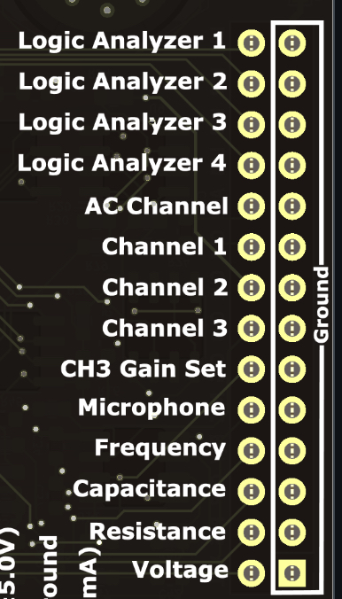
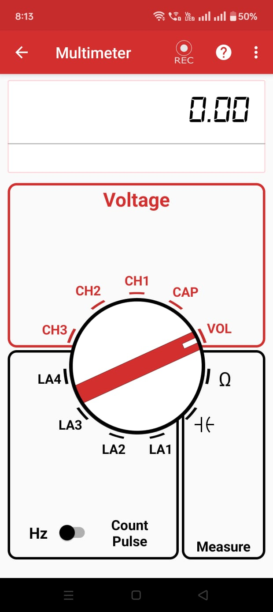
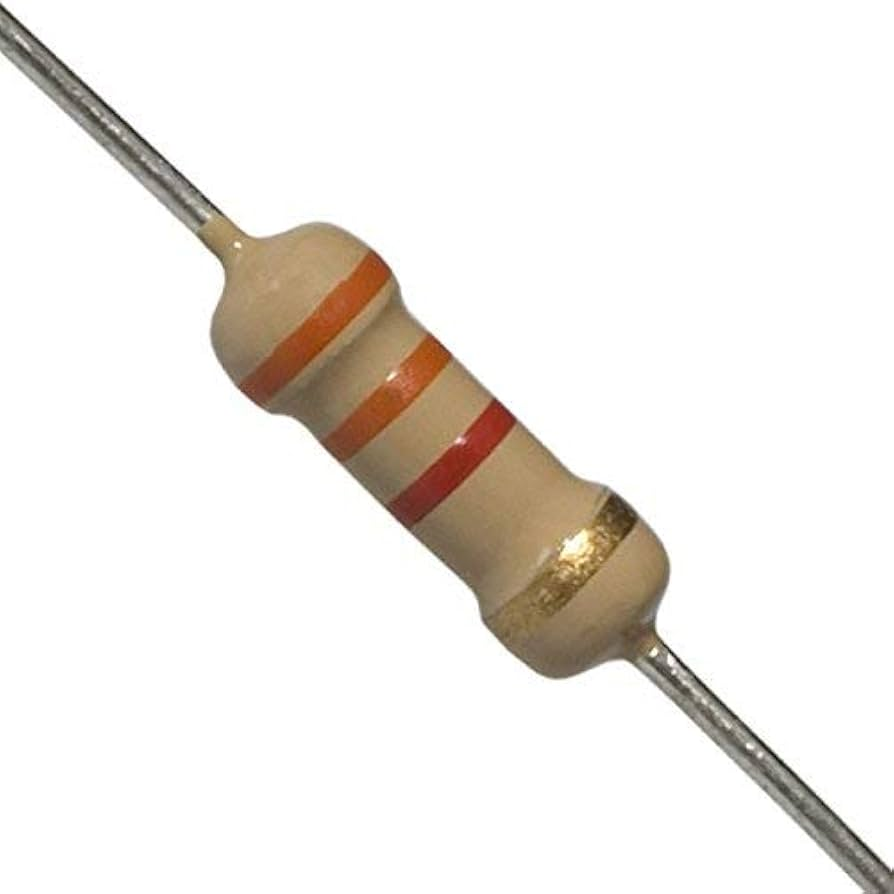
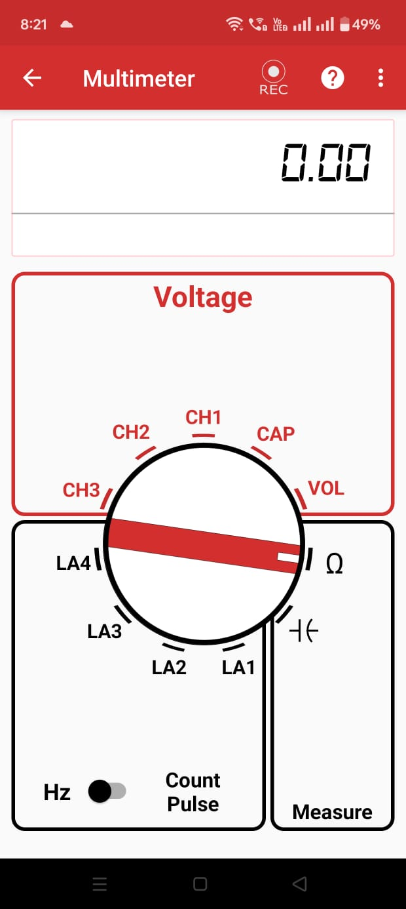
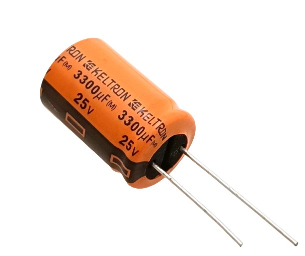
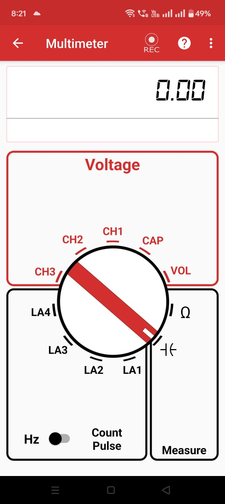
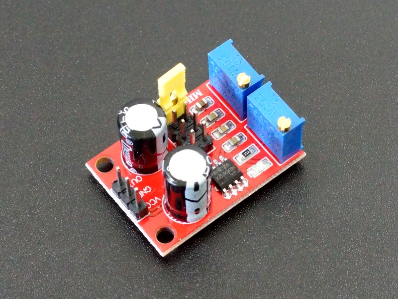
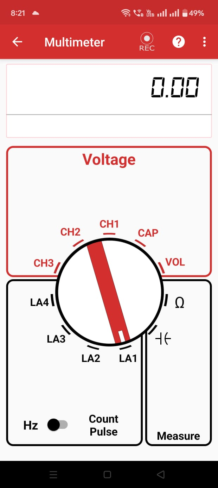

# Multimeter

## What's a Multimeter
A multimeter is an electronic tool used to measure various electrical properties such as voltage, current, resistance, capacitance and frequency.
It is used to measure voltage and current values at various points in a circuit that can be used for analysis of the electrical circuits and help in troubleshooting.

## How to use it

  

* Open the _PSLab_ app

* Navigate to the multimeter option on the _PSLab_ app home screen

* Select the type of measurement needed :
    * Voltage
    * Frequency
    * Clock Pulses
    * Resistance
    * Capacitance

* For measuring voltage, use:
    * CH1(16V to -16V)
    * CH2(16V to -16V)
    * CH3(3.3V to -3.3 V)
    * VOL(3.3V to -3.3 V)
    * CAP(Voltage Measurement on CAP)

  

* For measuring the frequency(Upto 4 MHz) or clock pulses:
    * Logic Analyzer 1
    * Logic Analyzer 2
    * Logic Analyzer 3
    * Logic Analyzer 4

* For measuring capacitance:
    * -| (- (pF to uF range)

* For measuring resistance:
    * Ω

### Important Features
* Multimeter Configuration:
    * The <strong>update period</strong> can be selected 
    * The <strong>location data</strong> can be included in logged files

* Logged data:
    * It stores the logs of the data collected by the multimeter

## <strong>Experiment: Measuring Voltage (check your battery) with _PSLab_</strong>

  

### Goal
Measure the voltage of a battery using _PSLab_.

### Materials Required

- Android Phone
- [_PSLab_](https://play.google.com/store/apps/details?id=io.pslab\&hl=en_US)[ Android App](https://play.google.com/store/apps/details?id=io.pslab\&hl=en_US)
- Battery(1.5V)

### Procedure

  

1. Open the _PSLab_ Android app.
2. Select the **Multimeter** option.
3. The app will display various Multimeter options:
   - **Voltage**
   - **Hz**
   - **Count Pulse**
   - **Measure**

4. Choose **VOL** in **Voltage** .
5. Connect the voltage and ground terminals of the battery to VOL and ground respectively using connecting wires.
6. **The voltage is displayed** and stored in the logs if the option is selected by user.

### Observations

- The reading of the Multimeter starts increasing as the battery is connected.
- The _PSLab_ successfully measures the battery voltage.

### Conclusion

The _PSLab_ measures the battery voltage.

## <strong>Experiment: Measuring Resistance with _PSLab_</strong>

  

### Goal
Measure the resistance of a resistor using _PSLab_

### Materials Required

- Android Phone
- [_PSLab_](https://play.google.com/store/apps/details?id=io.pslab\&hl=en_US)[ Android App](https://play.google.com/store/apps/details?id=io.pslab\&hl=en_US)
- Resistor(220 Ω)

### Procedure

  

1. Open the _PSLab_ Android app.
2. Select the **Multimeter** option.
3. The app will display various Multimeter options:
   * **Voltage**
   * **Hz**
   * **Count Pulse**
   * **Measure**

4. Choose **Ω** in **Measure**.
5. Connect the end terminals of the resistor to RES and ground respectively using connecting wires.
6. **The Resistance is displayed** and stored in the logs if the option is selected by user.

### Observations

- The value of the resistor is displayed in the multimeter.
- The _PSLab_ successfully measures the resistance value.

### Conclusion

The _PSLab_ measures the resistance of the resistor value.

## <strong>Experiment: Measuring Capacitance with _PSLab_</strong>

  

### Goal
Measure capacitance using _PSLab_

### Materials Required

- Android Phone
- [_PSLab_](https://play.google.com/store/apps/details?id=io.pslab\&hl=en_US)[ Android App](https://play.google.com/store/apps/details?id=io.pslab\&hl=en_US)
- Capacitor(110 pF)

### Procedure

  

1. Open the _PSLab_ Android app.
2. Select the **Multimeter** option.
3. The app will display various Multimeter options:
   - **Voltage**
   - **Hz**
   - **Count Pulse**
   - **Measure**

4. Choose **-| (-** in **Measure** .
5. Connect the voltage and ground terminals of the capacitor to CAP and ground respectively using connecting wires.
6. **The Capacitance is displayed** and stored in the logs if the option is selected by user.

### Observations

- The value of the capacitor is displayed in the multimeter.
- The _PSLab_ successfully measures the capacitance.

### Conclusion

The _PSLab_ measures the capacitance of the capacitor.

## <strong>Experiment: Measuring Frequency with _PSLab_</strong>

  

### Goal
Measure frequency of a 555 timer using _PSLab_

### Materials Required

- Android Phone
- [_PSLab_](https://play.google.com/store/apps/details?id=io.pslab\&hl=en_US)[ Android App](https://play.google.com/store/apps/details?id=io.pslab\&hl=en_US)
- 555 timer board(6.86kHz)

### Procedure

  

1. Open the _PSLab_ Android app.
2. Select the **Multimeter** option.
3. The app will display various Multimeter options:
   - **Voltage**
   - **Hz**
   - **Count Pulse**
   - **Measure**

4. Choose **LA1** in **Hz** .
5. Connect the voltage and ground terminals of the 555 timer board to Logic Analyser 1 and ground respectively using connecting wires.
6. **The Frequency is displayed** and stored in the logs if the option is selected by user.

### Observations

- The frequency value is displayed on the multimeter.
- The _PSLab_ successfully measures the frequency.

### Conclusion

The _PSLab_ measures the frequency of the 555 timer board.
