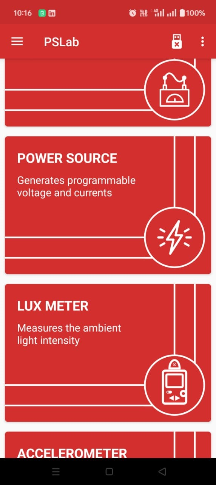
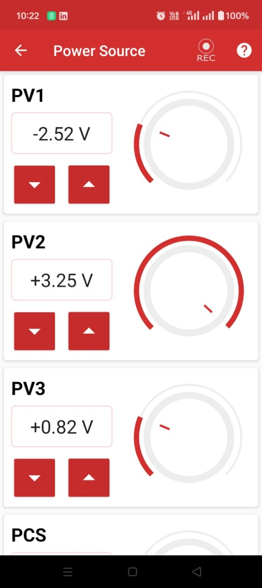

# Power Source

## What is a Power Source?

A power source is an instrument used to supply power to other equipment and sensors, enabling them to operate. The power is provided in the form of voltage or current.

## Current Power Source Ranges

**Voltage Sources:**

- **PV1**: ± 5 V
- **PV2**: ± 3.3 V
- **PV3**: 0-3 V

**Current Sources:**
- **PCS**: 0 - 3.3 mA

## How to Use

  

To use the variable power supply, connect the terminals from the _PSLab_ board to the output node according to your requirement.

### Procedure for Supplying Power:

1. Select the required power source from **PV1, PV2, PV3,** or **PCS**.
2. Set the desired value for the power source.
3. Connect the board to the equipment, such as an LED.

## Experiment: Powering an LED with _PSLab_

  

### Goal

To power an LED using the _PSLab_ inbuilt power supply.

### Materials Required

- Android Phone
- [_PSLab_](https://play.google.com/store/apps/details?id=io.pslab\&hl=en_US)[ Android App](https://play.google.com/store/apps/details?id=io.pslab\&hl=en_US)
- White LED with a power rating of approximately 3.2V

### Procedure

1. Open the _PSLab_ Android app.
2. Select the **Power Supply** option.
3. The app will display various power source options:
   - **PV1**
   - **PV2**
   - **PV3**
   - **PCS**

  

4. Choose **Voltage Source 2 (PV2)** for this experiment and set its value to the LED voltage (~3.2V).
5. Connect the ground and voltage terminals of PV2 to the LED terminals using connecting wires.
6. Adjust the power source knob until the required voltage is reached.
7. The LED will start glowing.

### Observations

- The LED illuminates when the correct voltage is applied.
- The _PSLab_ successfully supplies the required power.

### Conclusion

The _PSLab_ power source can effectively power an LED.

## Experiment: Powering a Buzzer with _PSLab_
### Goal

To power a buzzer using the _PSLab_ inbuilt power supply.

  

### Materials Required

- Android Phone
- [_PSLab_](https://play.google.com/store/apps/details?id=io.pslab\&hl=en_US)[ Android App](https://play.google.com/store/apps/details?id=io.pslab\&hl=en_US)
- Buzzer with a rating of 3V

### Procedure

1. Open the _PSLab_ Android app.
2. Select the **Power Source** option.
3. The app will display various Power Source options:
   - **PV1**
   - **PV2**
   - **PV3**
   - **PCS**

  

4. Choose **Voltage Source 1 (PV1)** and set its value to the buzzer's starting voltage (~2.5V).
5. Connect the ground and voltage terminals of PV1 to the buzzer terminals using connecting wires.
6. Adjust the power source knob until the required voltage is reached.
7. **The buzzer will start producing sound.**
8. Gradually increase the voltage to increase the buzzer's sound intensity.
9. Adjust the voltage as needed to achieve the desired sound level.

### Observations

- The buzzer starts producing sound when the correct voltage is applied.
- The _PSLab_ successfully supplies the required power.

### Conclusion

The _PSLab_ Power Source can effectively power a buzzer.
## Important Features

- **PV1 and PV3 are proportional to each other.**
- **PV2 and PCS are also connected (inversely proportional).**