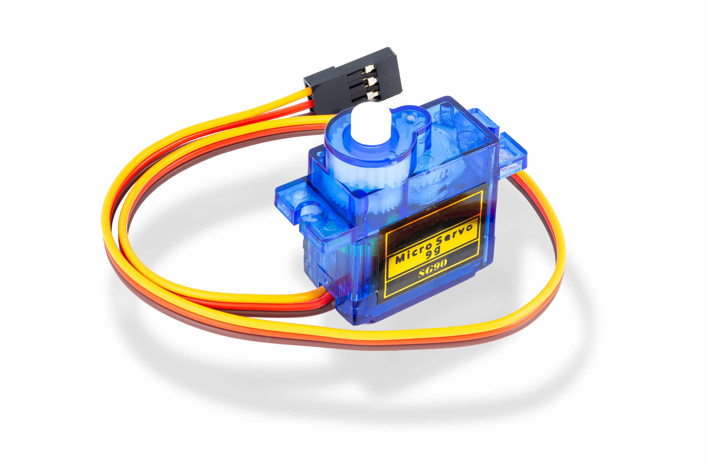

# Robotic Arm

## What is a Robotic Arm?

A **Robotic arm** is a mechanical structure that mimics the movements of a human arm. It typically consists of multiple joints controlled by actuators, most commonly **servo motors**, to achieve precise angular movement.

In the PSLab context, a robotic arm uses servo motors to perform tasks like conducting scientific experiments,  lifting, rotating, or grasping. These servos are controlled via **PWM (Pulse Width Modulation)** signals.

The **PSLab device** provides four square wave PWM outputs `SQR1`, `SQR2`, `SQR3`, and `SQR4` which allow control of up to **four servo motors**, enabling robotic arms with **up to four degrees of freedom (DoF)**.

---

## How to use it

### Requirements

- PSLab device  
- Robotic arm kit 
- Jumper wires
- External power supply

<div style="display: flex; justify-content: space-between; align-items: flex-start; flex-wrap: wrap; gap: 10px; margin: 10px 0;">
  
  
  
  
</div>


### Wiring Setup

1. Connect the **signal wires** (usually **yellow**) of the 4 servos to the PSLab device PWM outputs PINS: `SQR1`, `SQR2`, `SQR3`, and `SQR4`.
2. Connect the **power wires** (usually **red**) of all servos to the **positive terminal** of an **external power supply**.
3. Connect the **ground wires** (usually **black**) of all servos together to the **GND of the external power supply**.
4. Finally, connect the **GND of the external power supply** to the **GND pin** of the **PSLab device** to complete the common ground.

> ⚠️ **Important:** Do not power the servos directly from the PSLab device. Use an external regulated supply capable of handling the current requirements of all servos.


### Performing the Experiment

1. Open the **PSLab app** on your Phone.
  
2. Navigate to **Robotic Arm**.
3. Use the interface to:
   - Manually move each servo using sliders.
   - Create a timeline of servo movements.
   - Play, pause, or reset the timeline.
   - Change Frequency.
   - Save or import movements using CSV files.

<table>
    <tr>
        <td></td>
        <td></td>
    </tr>
</table>

  <div style="text-align: center;">
      <a href="https://youtu.be/zZ33pp560KA?si=OruiWHxXW4BBUqOx" target="_blank">Video 1</a> &nbsp;&nbsp;&nbsp;&nbsp;
      <a href="https://youtu.be/IFSByhxeXV4?si=CTsC6272dFxwbhG-" target="_blank">Video 2</a>
    </div>


### Timeline CSV Import/Export

The PSLab app supports importing servo movement timelines from a **CSV file**, allowing interoperability with the **PSLab Python library**.

#### Exporting Timeline using Python

You can generate servo movement timelines using the `pslab-python` library and export them in CSV format for use in the PSLab app.

Here's a minimal working example:

```python
from pslab import ScienceLab
from pslab.external.motor import Servo, RoboticArm

psl = ScienceLab()

# Initialize servos on PWM outputs PINS
base = Servo("SQ1", pwm_generator=psl.pwm_generator)
shoulder = Servo("SQ2", pwm_generator=psl.pwm_generator)
elbow = Servo("SQ3", pwm_generator=psl.pwm_generator)
grip = Servo("SQ4", pwm_generator=psl.pwm_generator)

# Create Robotic Arm instance
arm = RoboticArm([base, shoulder, elbow, grip])

# Define timeline: each row = [S1, S2, S3, S4] angles at 1s interval
# Use None to keep a servo at the same angle as the previous step
timeline = [
    [None, 30, 45, 10],
    [90, 30, 45, None],
    [180, 30, 45, None],
    [45, 60, 60, 20],
    [None, 60, 60, 20],
    [0, 90, 90, 30],
    [90, 90, 90, 30],
    [180, 90, 90, 30],
    [90, 45, 45, 0],
    [0, 30, 30, None],
]

# Run the timeline on the robotic arm
# This will move each servo to the specified positions sequentially at 1-second intervals
arm.run_schedule(timeline=timeline)

# Export timeline to CSV for using in PSLab App
arm.export_timeline_to_csv(
    timeline=timeline,
    folderpath=r"C:\path\to\folder"
)

# Import timeline from a CSV file
timeline = arm.import_timeline_from_csv(filepath=r"\path\to\folder\filename.csv")

```

### Observations

- Each servo rotates to the specified angle.
- Timeline playback, with position updates every 1 second, allows synchronized movement across all joints.

### Applications

- Pick-and-place mechanisms
- Educational demos in robotics and automation


