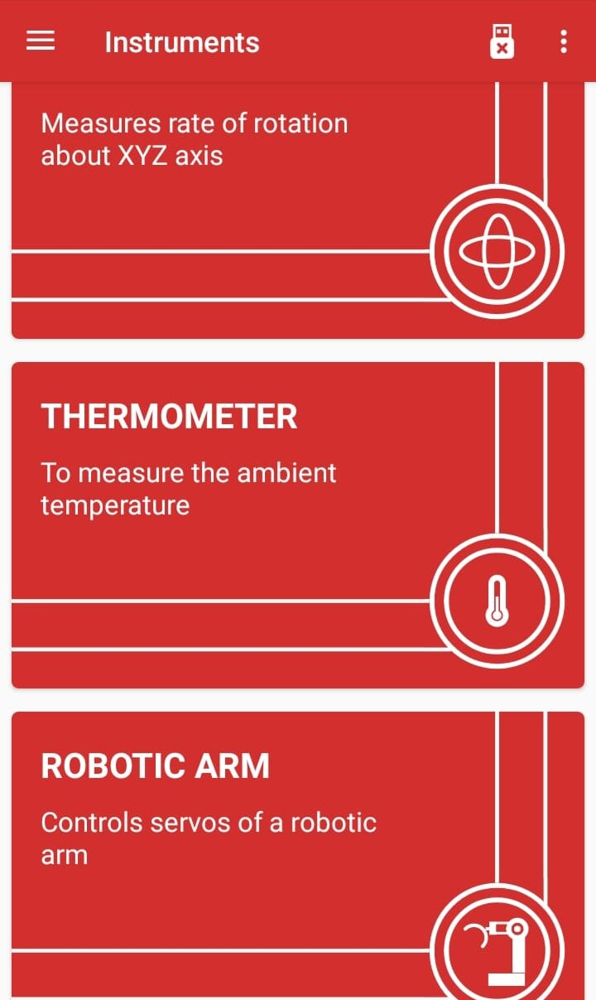
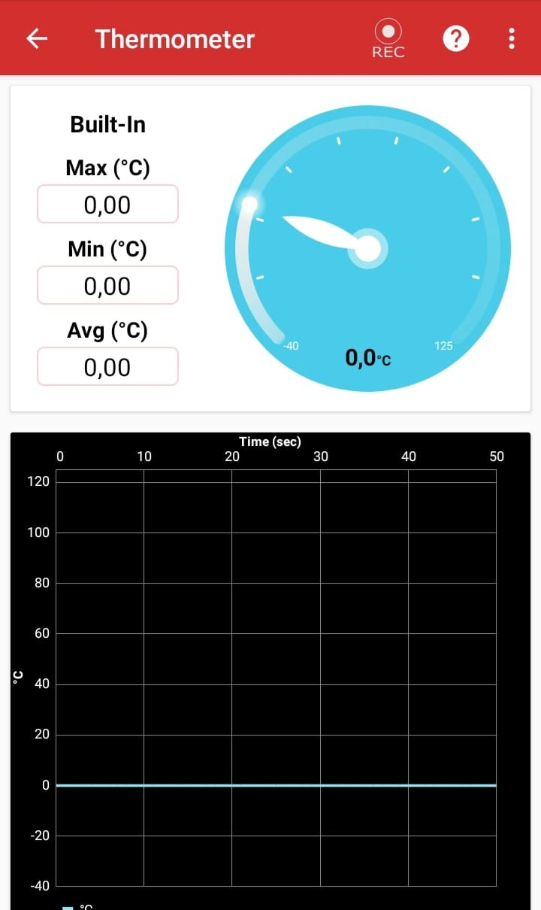

# Thermometer

## What is a Thermometer
Thermometer instrument is used to measure ambient temperature. It can be measured using inbuilt ambient temperature sensor or through SHT21.

## Digital Barometer in PSLab

Material Required:
* Android Phone
* [PSLab Android App](https://play.google.com/store/apps/details?id=io.pslab&hl=en_US)

Procedure:
1. Navigate to The PSLab Android App on your device.
2. Click on the App to turn it on.
3. Now On the instruments page scroll down until you reach the Thermometer instrument option.

4. On tapping the Thermometer instrument the barometer instrument opens and can be used.

